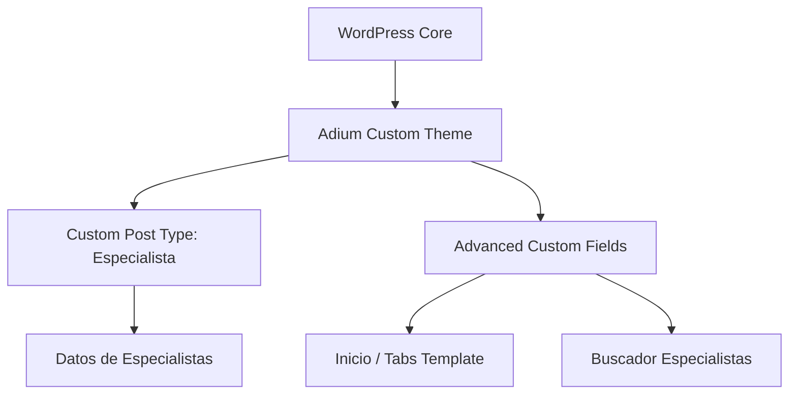

# 02_SDD.md - Software Design Document (SDD)

## 1. Arquitectura del Sistema
El sitio web se desarrollará sobre **WordPress** como CMS principal.
Utilizaremos un tema personalizado minimalista (`adium-theme`) desarrollado en PHP nativo estructurado para maximizar el rendimiento y permitir animaciones fluidas sin la sobrecarga de constructores de páginas.

## 2. Definición del Tema WordPress (`wp-content/themes/adium-theme`)
La estructura del tema constará de los siguientes archivos:
- `style.css`: Cabecera del tema y estilos globales (CSS puro sin frameworks pesados).
- `functions.php`: Registro de scripts, hojas de estilo, soporte del tema y carga de módulos.
- `header.php`: Estructura HTML de cabecera y navegación.
- `footer.php`: Estructura HTML del pie de página.
- `front-page.php`: Maquetación de la página principal (Banner de Consulta y Pestañas).
- `page-cuestionario.php`: Plantilla para Cuestionario (Pestañas y Banner del Cuestionario).
- `archive-especialista.php`: Plantilla para el motor de búsqueda y resultados de Especialistas.
- `page-terminos.php`: Plantilla para Términos y Condiciones.
- `inc/cpts-especialistas.php`: Registro de Custom Post Types y Taxonomías.
- `inc/acf-fields.php`: Registro de grupos de campos de ACF mediante código.

## 3. Estrategia de Renderizado de Interfaces (CSS y HTML)
- **CSS Nativo**: Se utilizarán variables CSS (Custom Properties) para los colores y fuentes definidos por el diseñador:
  - `--color-primary-magenta`: `#D82B5A`
  - `--color-secondary-orange`: `#F59A6D`
  - `--color-bg-light`: `#F0F2F5`
  - `--color-text-dark`: `#2D3748`
  - `--color-footer-bg`: `#2F3E46`
- **Flexbox y CSS Grid**: Se utilizarán esquemas de Flexbox y Grid para maquetar de forma precisa y adaptativa (responsive) sin necesidad de frameworks CSS externos.
- **Micro-animaciones**: Se añadirán efectos de transición suaves (`transition: all 0.3s ease`) en botones, pestañas de menú e inputs.

## 4. Implementación del Buscador de Especialistas
- **Búsqueda Geográfica**: El formulario en `archive-especialista.php` realizará una consulta de tipo `WP_Query` basada en los campos personalizados de ACF o términos de taxonomía.
- **Dropdowns Interactivos**: Se utilizará JS para filtrar de forma dinámica o mediante recarga rápida de la página la selección de Departamento -> Provincia -> Distrito -> Ciudad.
